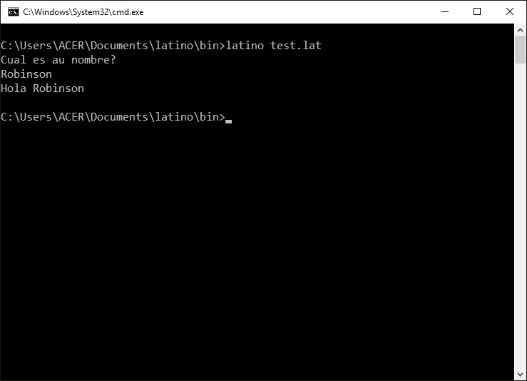

# Básico

Algunas cosas básicas a tomar en cuenta para empezar a programar

### Extención es  .lat

La extención con que se trabaja es **.lat**, debes tener cuidado al crear tus documentos y verificar bien que llevan esta extención


### 

### Mostrar algo en pantalla

```
escribir("Hola Latinos")
```

> También puedes usar el imprimir\(\) que es lo mismo, usa el que más te guste

```
imprimir("Hola latinos")
```

### Obtener un valor del usuario vía la consola

Si quieres interactuar con el usuario y pedirle que introduzca alguna información, puedes usar este formato para hacerlo

```
leer()
```

Esto lee lo que el usuario escribe, y lo podrias asignar a una variable para poder trabajar con los valores recojidos.  
Ejemplo

```
escribir("Cual es tu nombre?")
nombre = leer()
escribir("Hola " . nombre)
```

> El punto '.' lo usamos para concatenar \(para juntar\)



